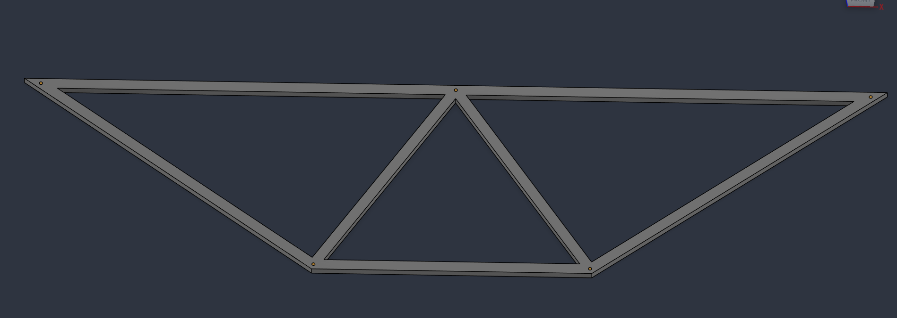
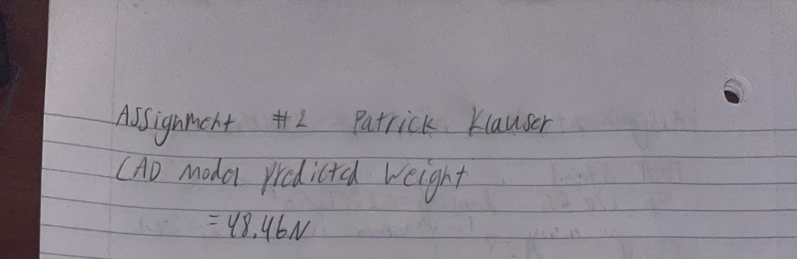
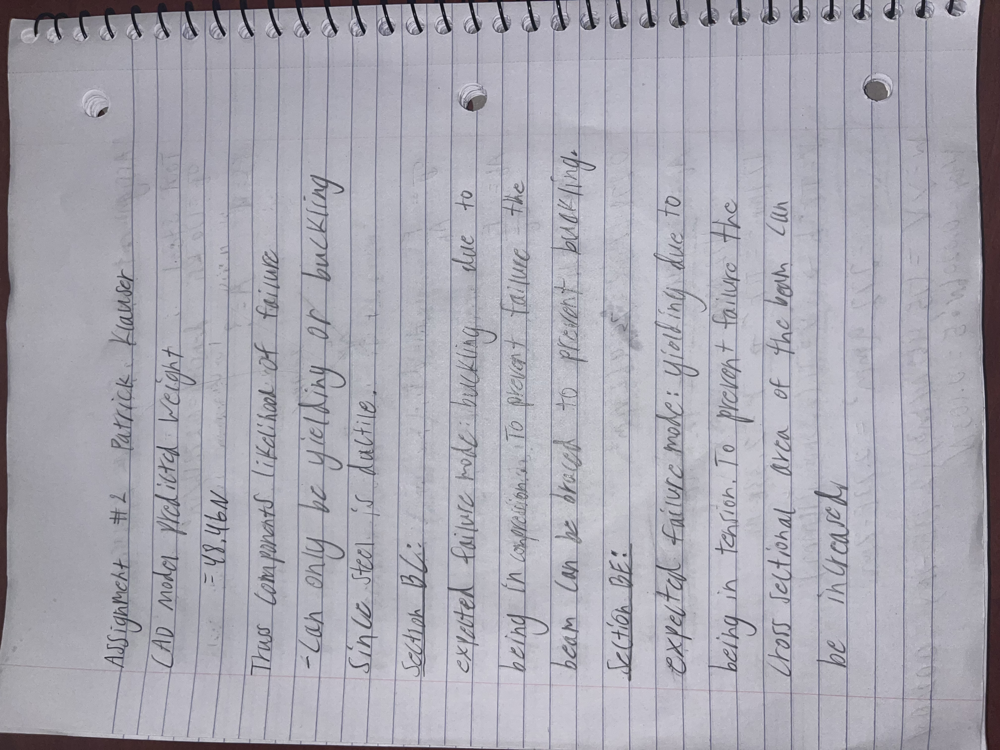
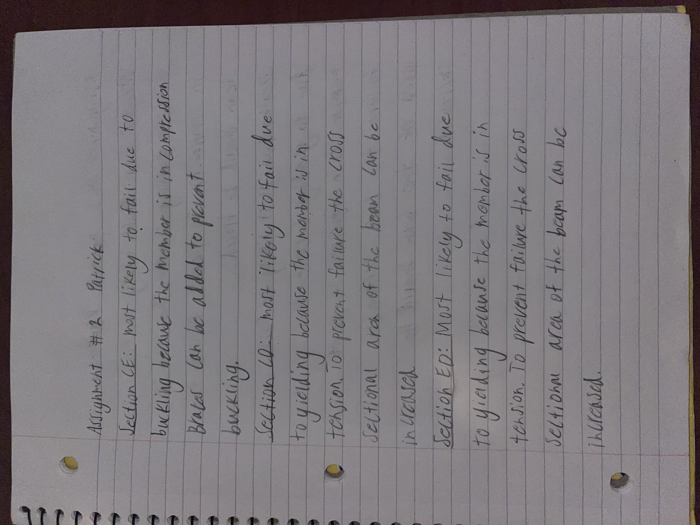
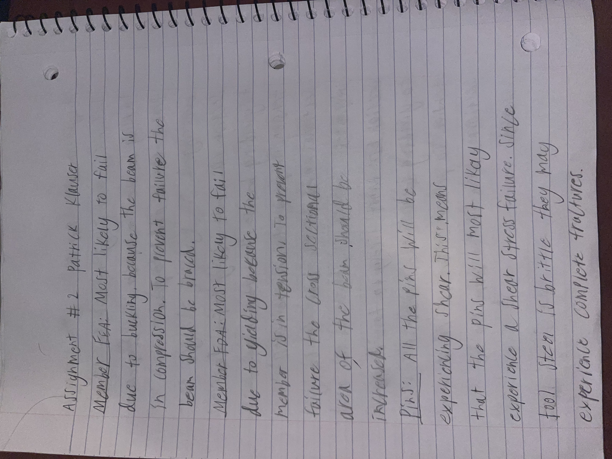
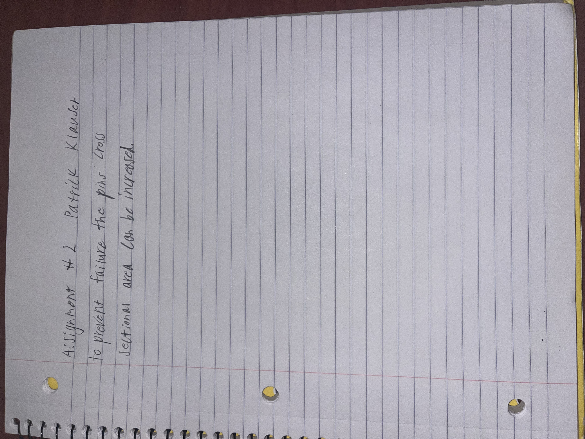

# A2 – Truss Stress Analysis

## Objective
In this assignment I was tasked with designing a truss to made of a500 steel to support a load at two different points with a factor of safety of 3.5.

## Analyze and Decide
For the design of my truss I chose to create 3 triangles using 7 members. I chose 3 triangles because I noticed that the points B, A, C, and D were evenly spaced horizontally and that C,D and B, A were spaced evenly vertically. Seeing this I immediately imagined how triangles could fit that space and used 3 triangles of the same size to make connections at all of those points. I chose to use triangles for two main reasons, the first being that triangles are known to be very stiff and the second being that it was mentioned in class that we should be using triangles. I wanted to keep the design and calculations simple so I made the whole design symmetrical.

## Calculations
After I completed my design, I did method of joints on each joint to find the forces in every member.

After doing my joint analysis I calculated the cross sectional area for all the beams needed to safely support the loads with a factor of safety of 3.5.

After doing the calculations for the cross sectional area I was able to calculate the volume. Using the volume I can google the weight density and use that to find the total weight of the truss.

## Cad Design
For my CAD design I used Fusion360 I used the exact lengths and widths of my beams alongside the diameters of the bolts in each section. I then extruded the entire thing by 16mm to create the overall shape. In fusion 360 I set the material for the structure as Mild Steel to get a weight calculation. Cad Files: [Here](Truss.step)

## Likelihood of Failures in Truss
For this section I began by using Gemini to give me a description of what the different failure modes where and how they occurred. Using that information I gave a description of what I believed was the most likely cause of failure in each member and how the likelihood of that failure could be reduced. For the pins I used that same method describing the failure mode of the bolt and how it's likelihood could be reduced.

## Conclusion
Designing this truss was my first time combining my knowledge of statics and solid mechanics to make a full size structure that can theoretically carry a certain load at two different points without failing. I’m surprised at how simple this was to do once I understood what the goals and constraints of the design were. I had to use statics to solve for the forces and then mechanics to solve for the cross sectional area needed for all the beams and pins. The main thing I’ve learned is how approachable designing these structures is after you understand the fundamentals.

