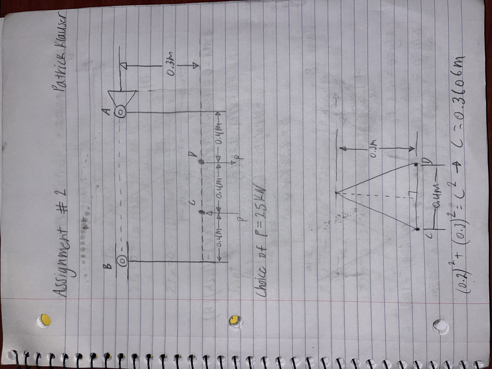
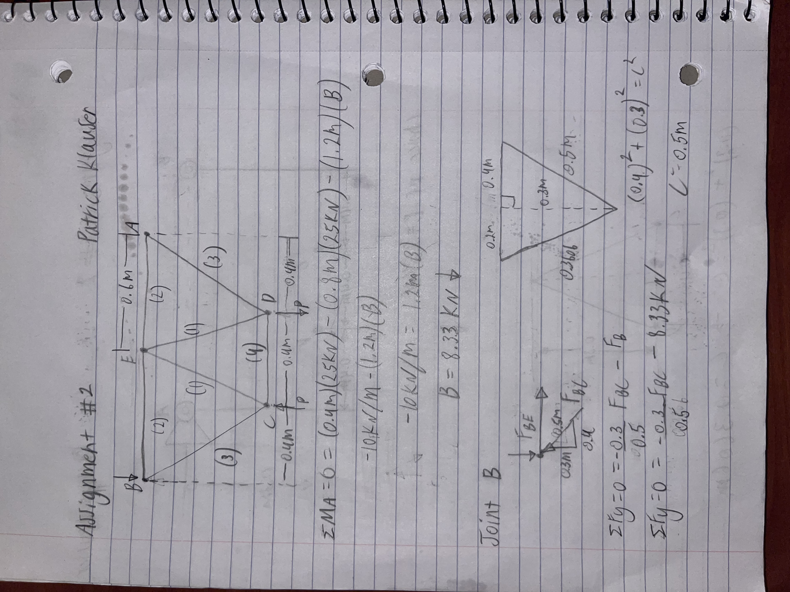
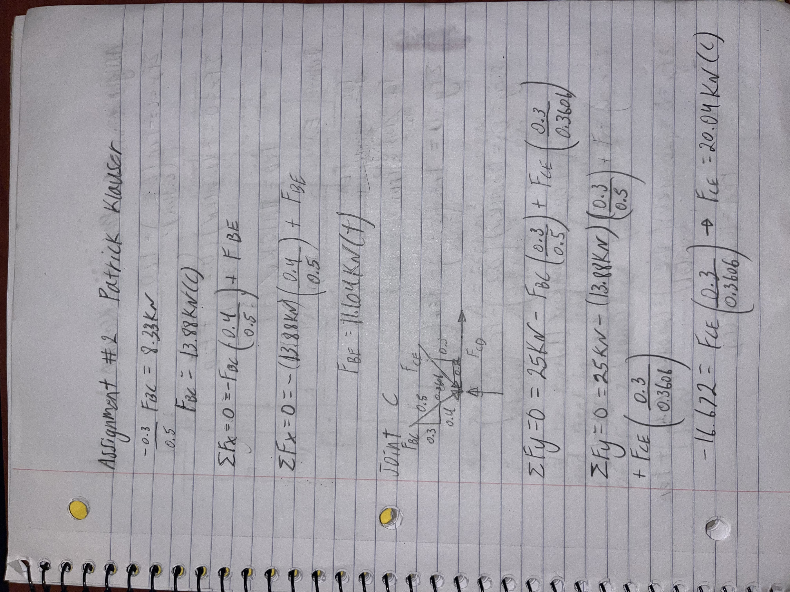
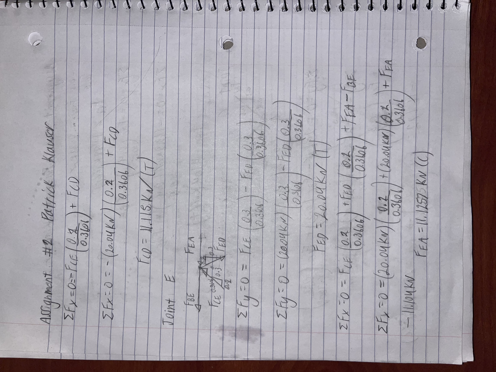
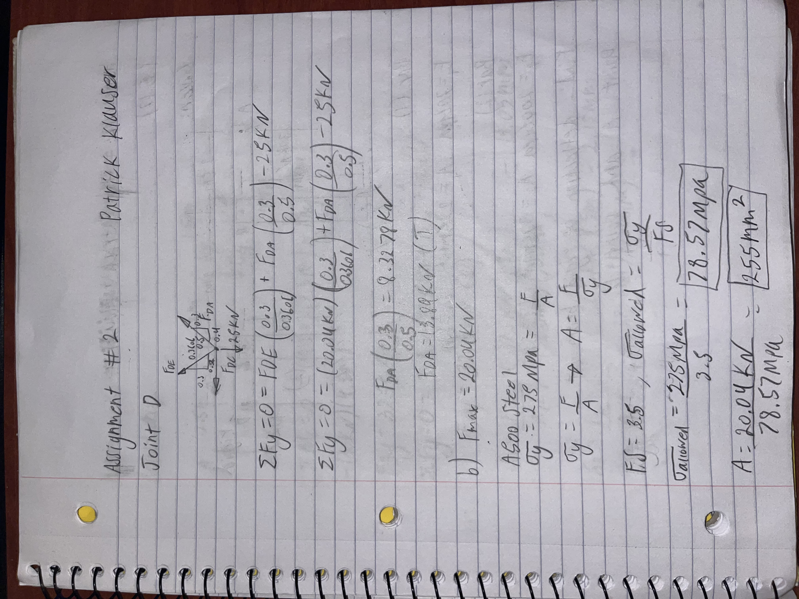
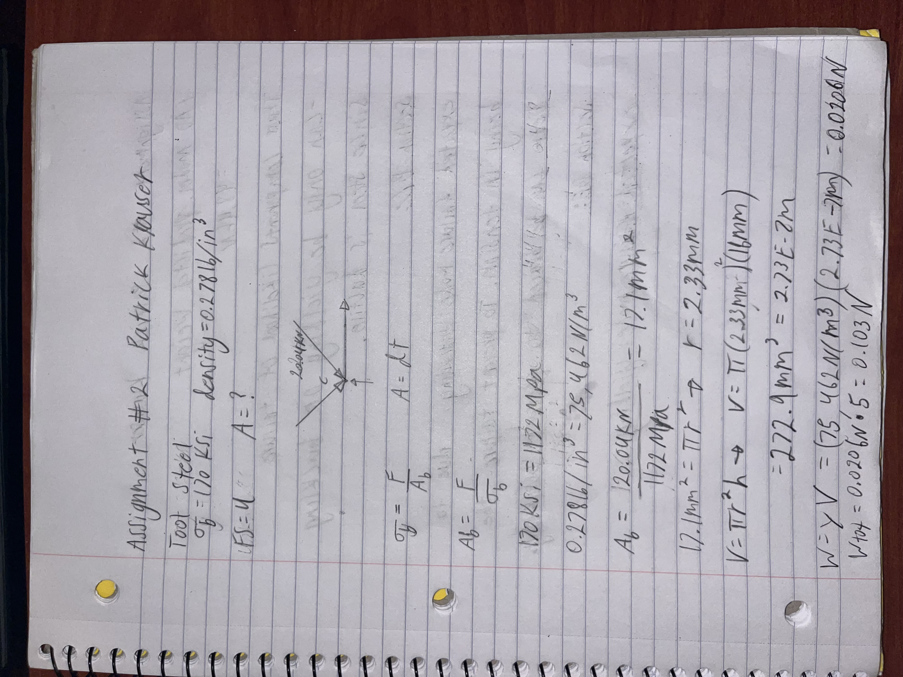

# A2 – Truss Stress Analysis

## Objective
In this assignment I was tasked with designing a truss to made of a500 steel to support a load at two different points with a factor of safety of 3.5.

## Analyze and Decide
For the design of my truss I chose to create 3 triangles using 7 members. I chose 3 triangles because I noticed that the points B, A, C, and D were evenly spaced horizontally and that C,D and B, A were spaced evenly vertically. Seeing this I immediately imagined how triangles could fit that space and used 3 triangles of the same size to make connections at all of those points. I chose to use triangles for two main reasons, the first being that triangles are known to be very stiff and the second being that it was mentioned in class that we should be using triangles. I wanted to keep the design and calculations simple so I made the whole design symmetrical.

## Calculations
After I completed my design, I did method of joints on each joint to find the forces in every member.

## Communicate

