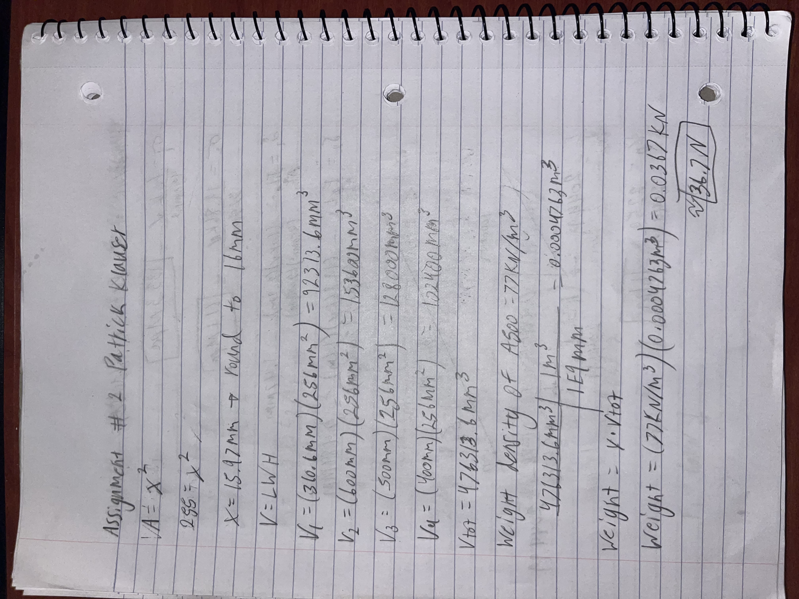

# A2 – Truss Stress Analysis

## Objective
In this assignment I was tasked with designing a truss to made of a500 steel to support a load at two different points with a factor of safety of 3.5.

## Analyze

## Decide
_Which geometry did you select, and why? This is your first open design choice in the course — defend it._

## Communicate

