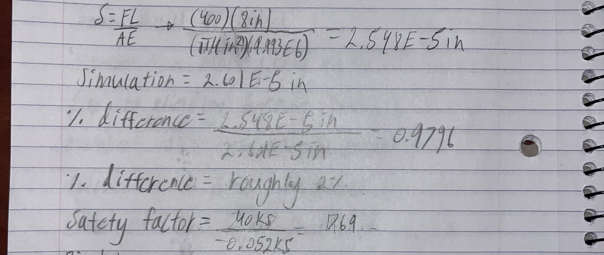
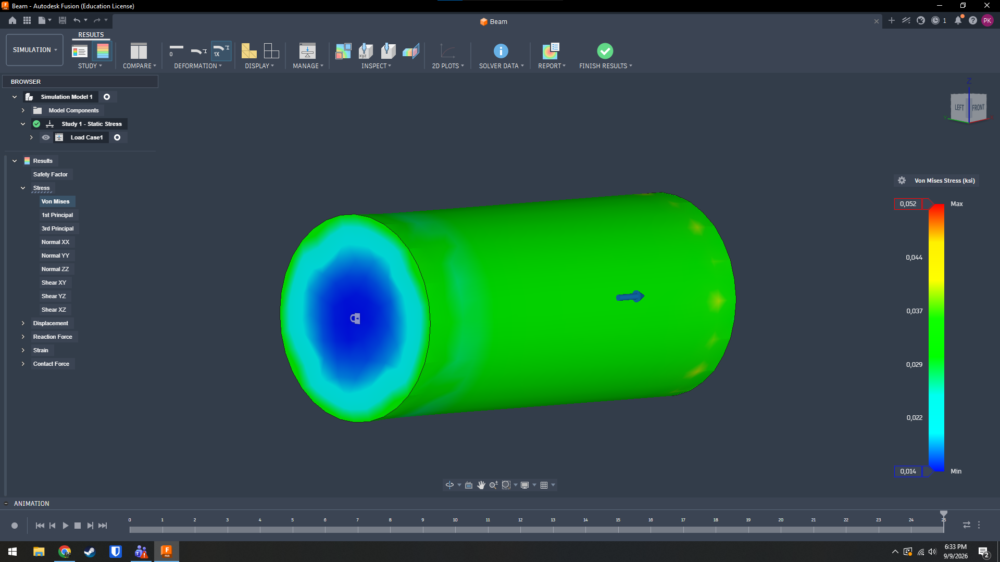

# A3 – Parametric Design and FEA of a Beam

## Parametric Design
To begin this project I chose the dimensions of my beam as 4in in diameter and 8in in length. I then used the YouTube video linked in the assignment to learn how to parametrically design this beam's diameter and length so that they can be modified at any point. I then chose my force on the beam to be 400lb, using that force I calculated what the elongation of the beam should be 2.548E-5in.

## FEA
Using the video provided I was able to set up a FEA simulation with one side of the bar fixed in place and the other side of the bar had the 400lb load attached. After running the sim I was able to see the total elongation and total stress felt by the beam.

## Decide

## Communicate

