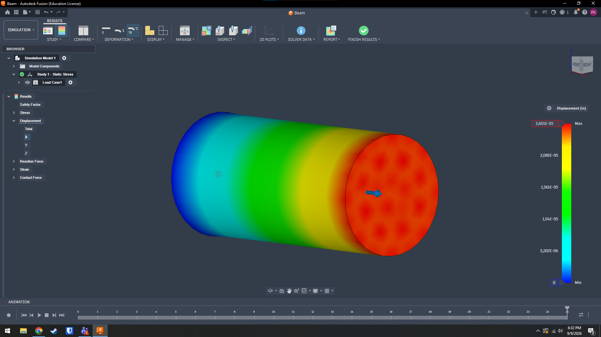
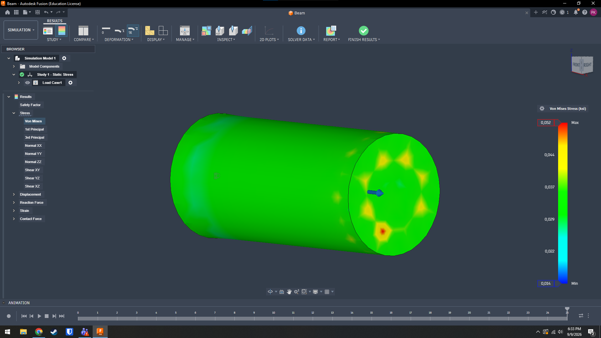
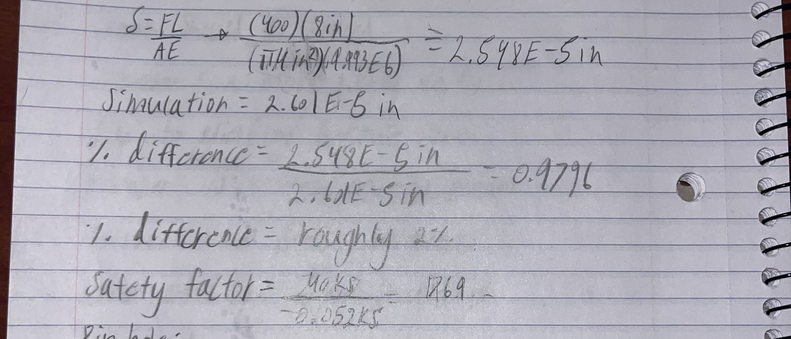
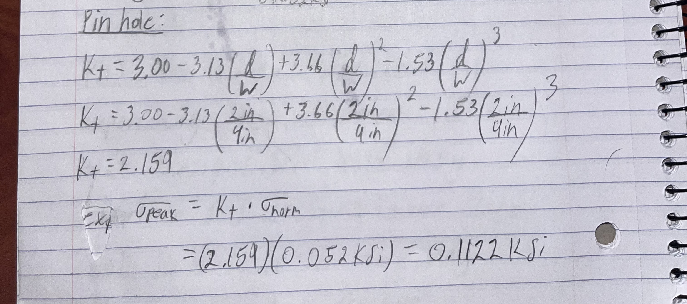
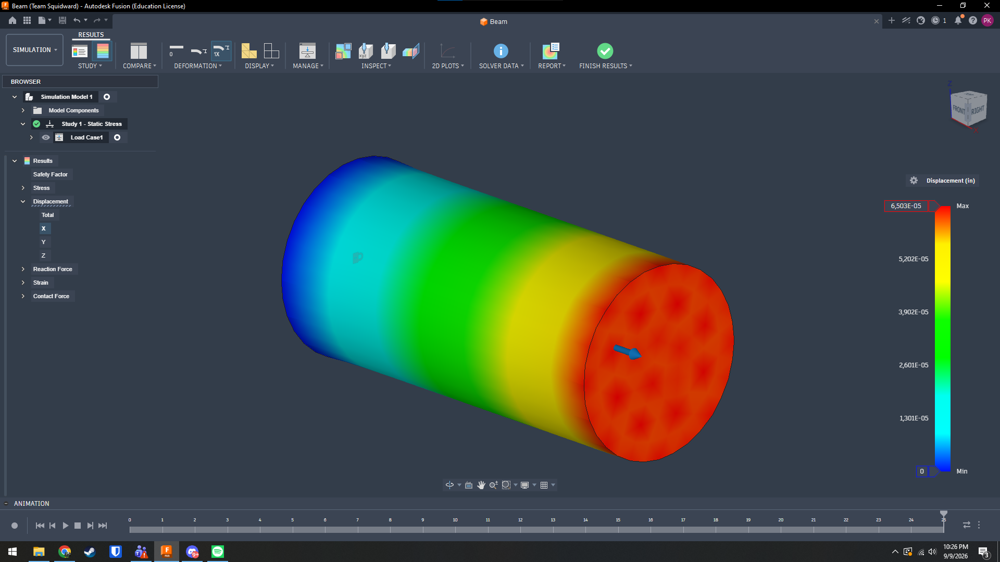

# A3 – Parametric Design and FEA of a Beam

## Parametric Design
To begin this project I chose the dimensions of my beam as 4in in diameter and 8in in length. I then used the YouTube video linked in the assignment to learn how to parametrically design this beam's diameter and length so that they can be modified at any point. I then chose my force on the beam to be 400lb, using that force I calculated what the elongation of the beam should be 2.548E-5in.

## FEA
Using the video provided I was able to set up a FEA simulation with one side of the bar fixed in place and the other side of the bar had the 400lb load attached. After running the sim I was able to see the total elongation and total stress felt by the beam. Link to the CAD file here
### elongation

### Stress

After doing the FEA I calculated that the max stress was significantly lower than the 40ksi strength of aluminum at 0.052ksi. I then calculated that the % difference between my calculated deflection and my actual deflection was about 2%. I would say this is a meaningful discrepancy and I believe it was caused by the mesh density. When generating the mesh the density looked to be very low and knowing that I believe it could have a worse approximation than my hand calculations. Overall I would trust the hand calculations more because the equations behind them have been tested for decades, if the mesh was much finer I would consider the mesh more seriously. I also calculated a safety factor of an enormous 769.

## Pin Hole 
For the pin hole calculations I used Peterson's chart equations and made a pin hole with a 2in diameter. I calculated a peak stress of 0.1122ksi which is well within the 40ksi strength of aluminum.

## Modify Parameters
For this section I increased the load on the beam to 1000lbs. I believe the increased force will make the beams length increase even further then it did previously.

In this case the beam elongated about 6.53E-5in which is more than double the deflection of the beam at the previous 4 pounds. This is easy to predict as the equation for delta = FL/AE and increasing F by slightly over 2x should increase the elongation to the exact same amount.
## Lessons Learned
After completing this assignment I feel that I've just began learning how to use parametric CAD in a more powerful way. I've also used the simulation part of a parametric CAD for the first time and I enjoyed how smoothly it went. I feel much more empowered to try these features on my own for design's that I've already made for 3d printing. This took me about 6 hours and I got a bit confused about getting the equations inside of the parameters in fusion360. 

