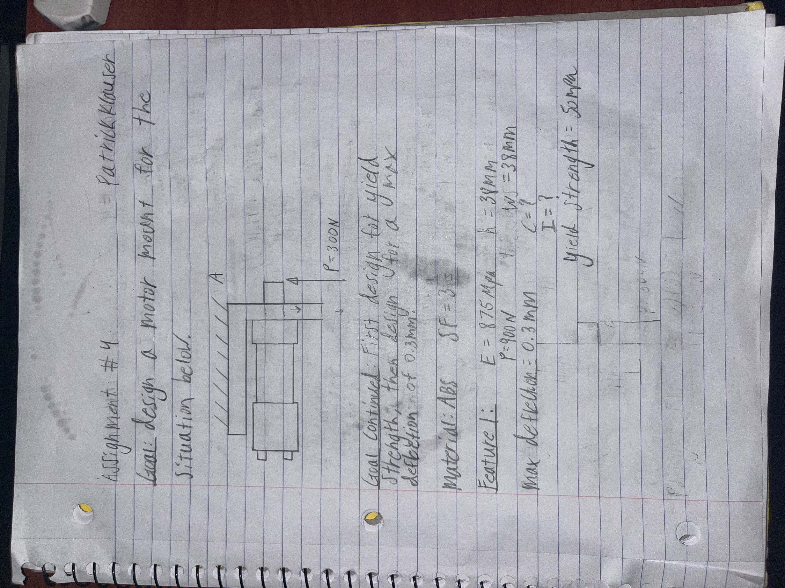
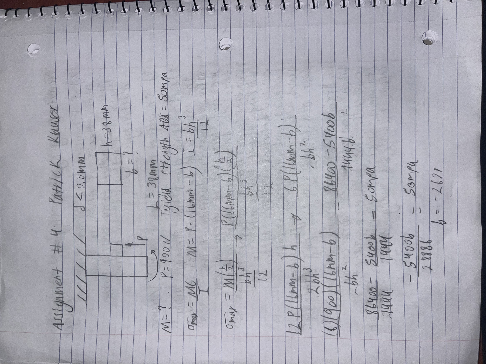

# A4 – Motor Mount

## Material Choice
I chose ABS for 3 main reasons, the first being that it has the 2nd highest stiffness of the two materials. The second reason is that ABS had the highest fatigue resistance of all 3 materials. The final reason is that ABS also has the highest melting point of the 3 materials. Stiffness is important in a motor mount because you generally want the shaft to stay in its exact position when operating since it is usually connected to something. Fatigue resistance is important because it allows for the mount to be used for a longer time before needing to be replaced. The melting temp is important because electric motors will heat up as they are operated. This heating can cause the mount to deflect in the lower melting temp materials which would cause the shaft to deflect from its original position. [Mount inspiration](https://www.amazon.com/dp/B0BNNN9RL2?lv=shuf&channelId=500&plpRedirect=mhFallback)

## Feature #1
For this feature I chose a length of 38mm because this gave 5mm of extra space on each side of the feature. The extra 5mm allows for the top of any bolts to protrude outwards and gives more material for the mounting holes to transfer stresses onto. For the thickness I chose 38mm again to allow for extra material around the holes of the mounting points to help transfer stresses.I also assumed the ABS had an elastic modulus of 875Mpa and a yield point of 50Mpa.

[CAD Files](Motor Mount.step)

## Decide

## Communicate

