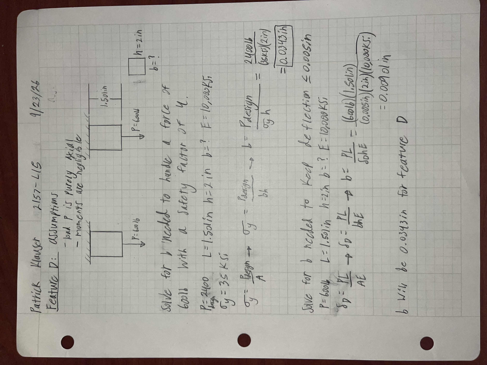
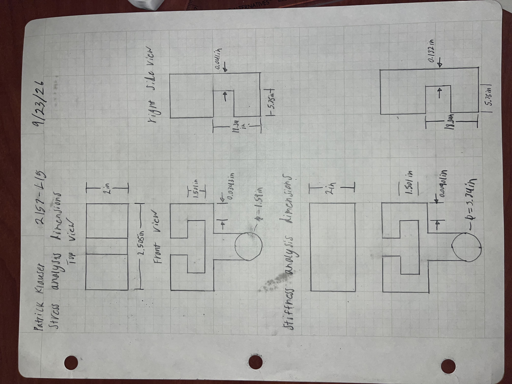

# A5 – Bracket For Nylon Strap Design

## Objective
The goal for this bracket is for it to slot into a rail of certain dimensions and hold a nylon strap with 1200lbs of force being applied to it. 

## Analyze
In order to determine the dimensions for the different features of this bracket I will do a stress analysis in each feature. Then I will determine the minimum dimensions needed based on that stress. After that I will determine minimum dimensions needed based on a minimum deflection of less than 0.005in being required. Finally I will choose the larger dimension from the two calculations to ensure the part fulfills all of its requirements.
### Feature A
For feature A I chose a length of 5.75in since that is the width of the strap that is applying the load on the feature.

### Feature B 
For feature B I chose a length of 18.34in in order to fit the entire roll of polyester cord strapping. Looking back this was completely unnecessary since the problem states that only a single piece of the strap is pulling on the feature. I also assumed load P was purely axial to simplify calculations and that was the same reason I chose to treat the moments as negligible.

### Feature C 
For feature C I chose to treat it as a beam between with fixed supports on either side and a point load at it's center. I assumed the feature wont fail in shear because this simplifies calculations. I chose the point load to be at the center because the feature connected to it is connected at the center and although it would change things slightly if I treated it as a distributed load I deemed it to be negligible.

### Feature D
For feature D I chose to treat it as two beams with a fixed support above both and a point load pulling down axially on each. I set P as 600lbs on each since intuitively I knew the forces would be distributed to both features evenly because they were symmetrical.

### Sketches

### Link Component

## Decide

## Communicate
In this project my feature C had a close value for both its height required for the stress 0.336in and its height required for the stiffness 0.36in. Ultimately I chose 0.36in and I believe the it needed the extra thickness in bending because the load was far from the supports which created a much higher moment at the supports and ultimately a higher stress. I was able to prevent all errors from propagating by double checking all of my equations and their units. For feature C I had assumed that It would not fail in shear, if this assumption was incorrect then that part could have a shear failure.

