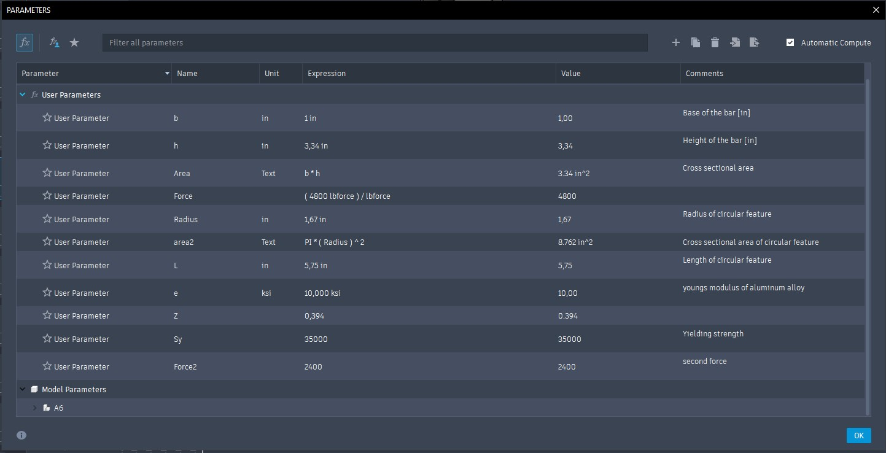
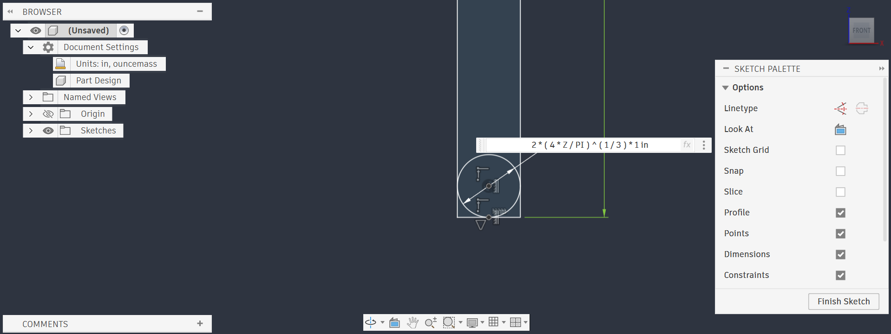
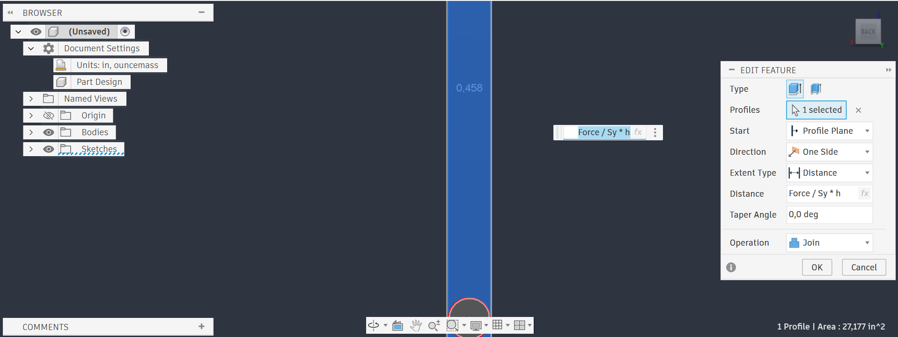
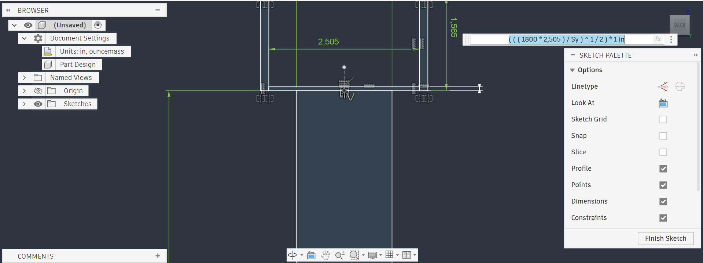
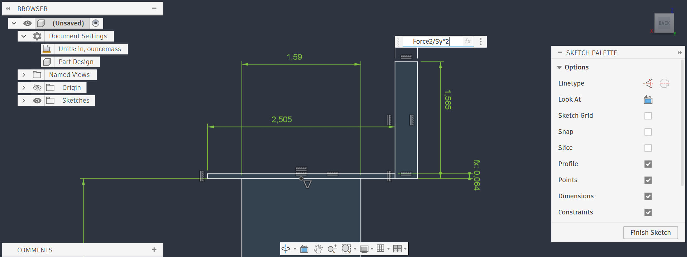
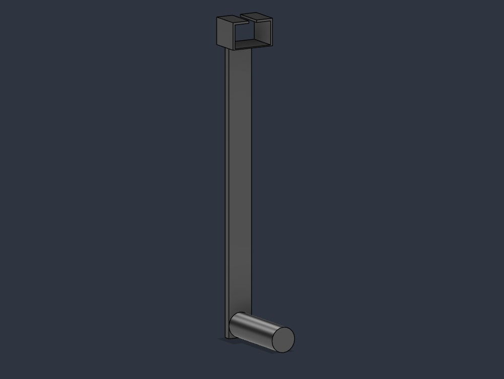
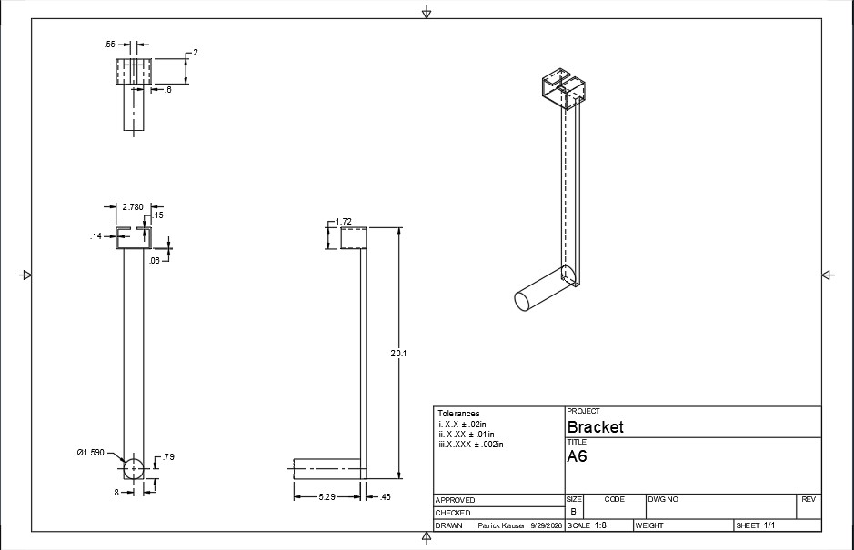
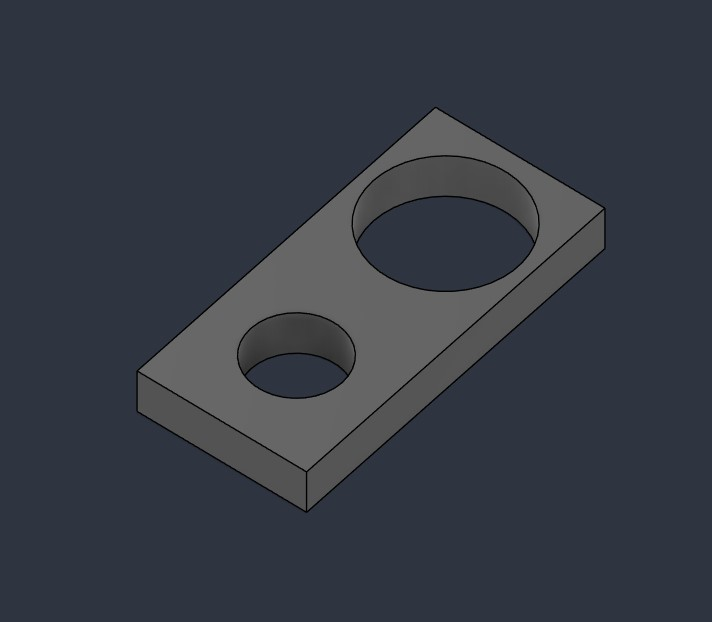
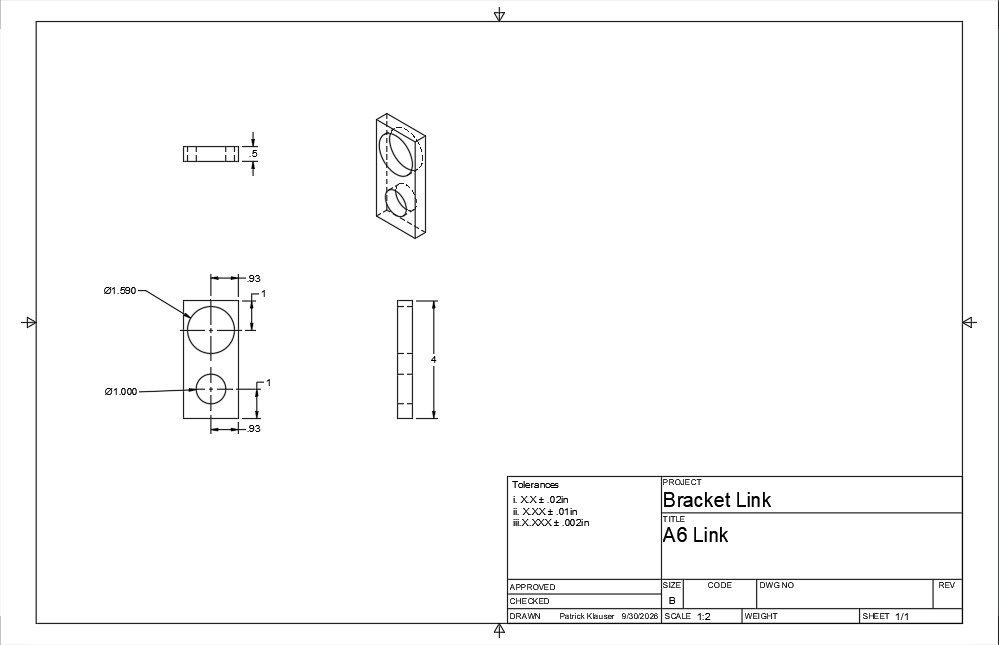

# A6 – [Bracket Drawing]

## Objective
The overall goal of this assignment was to take our design from the previous assignment and create a 3d model using parametric CAD. After creating that 3d model we were also tasked with making an effective engineering drawing that could be interpreted by a machinist to create our part. 

## Analyze
In order to create my parametric CAD model I needed to first create my parameters and after that I could create the relevant dimensions using those initial parameters. Once the part's were modeled I could use Fusion360's engineering drawing tool to create the drawings for both the Bracket and it's link.

## CAD 
### Parameters

### Dimensions

### Models + Drawings

## Communicate
In this assignment I modeled all the parts based on the max stress that they needed to handle. More specifically I modeled the circular feature that was contacting the strap using the equation r=(4*Z/H)^1/3 and multiplied it by two to get the diameter of the feature. I set up parameters for all those values and then made the equation inside of the dimension itself. Speaking of circular features, I chose to use an extra high tolerance for the holes on the link part. I made this decision because both holes needed high precision of 0.005in and 0.008in to ensure they meet the standard for a sliding fit and assembly pressure fit.
After completing this assignment I've learned how to make proper engineering drawings. I also got more experience using parametric CAD. 

